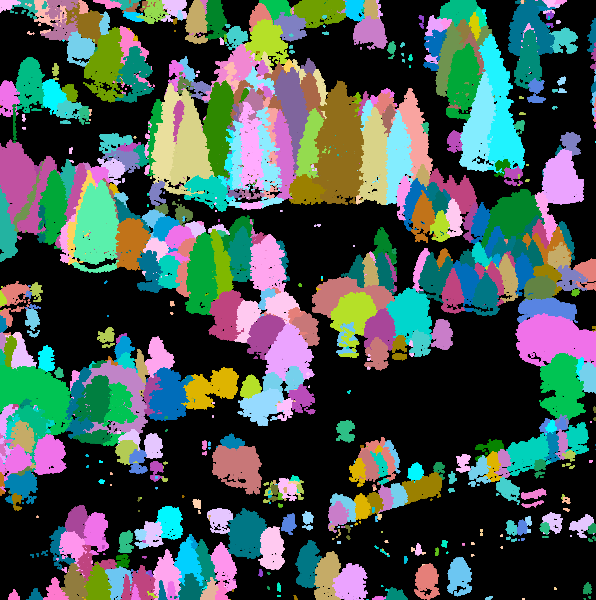
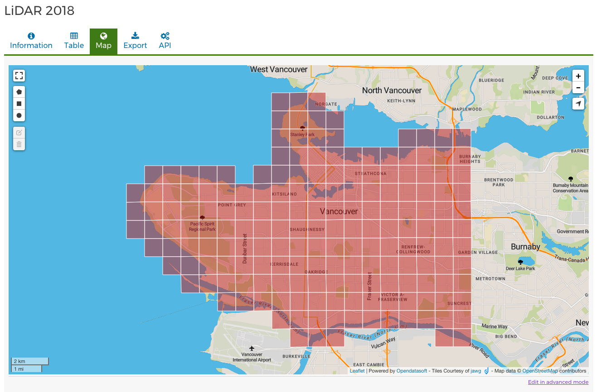
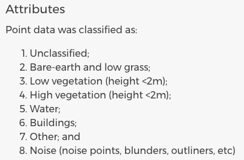
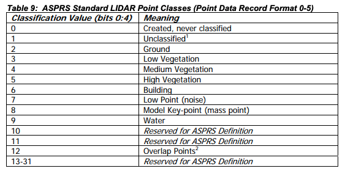

# Tree Segmentation
This is the code repository for the UBC Tree Project. The purpose fo this repository:

- To document detailed steps in processing LiDAR.
- To visualize results.
- To provide code to segment and create individual tree hulls.



## Dependencies
* lidR        (2.14+)
* rlas        (1.3.4+)
* rgdal       (1.4-8+)
* tictoc      (1.0+)
* sp          (1.3-2+)
* concaveman  (1.0.0+)

## How to run
The R script to process point cloud data and output tree canopy polygons is called **lidar_processing_pipeline.R**

There should be an input directory containing a collection of 1 or many las/laz files. 

e.g.

`files <- list.files(path="/path/to/input_las_files", pattern="*.las", full.names=TRUE, recursive=FALSE)
`

There should also be a path to a directory which will contain the shapefile/s of tree canopies.

e.g.

`outws <- "/path/to/output_shps"`

# Processing LiDAR point cloud data

This tutorial builds on a `lidR` tutorial called [Segment individual trees and compute metrics](https://github.com/Jean-Romain/lidR/wiki/Segment-individual-trees-and-compute-metrics) by exploring in-depth the process of preparing the raw point cloud prior to tree segmentation. 

### Downloading data
Let's start a las tile from the UBC campus with a nice mixture of buildings and trees. The City of Vancouver has a really nice web interface:



For this tutorial, we are going to download and work with [tile 4810E_54560N](https://webtransfer.vancouver.ca/opendata/2018LiDAR/4810E_54560N.zip)

Before we even unzip the downloaded file, let's inspect all of the available metadata to get a sense of how much we know about the data. Luckily, the web interface has a [nice metadata page](https://opendata.vancouver.ca/explore/dataset/lidar-2018/information/?location=12,49.2594,-123.14438). We can see from the metadata a few important features:

- The projected coordinate system is NAD 83 UTM Zone 13N
- Points density is 30 pts / m^2
- Data was acquired from August 27th and August 28th, 2018
- Points were classified as follows

      1. Unclassified;
      2. Bare-earth and low grass;
      3. Low vegetation (height <2m);
      4. High vegetation (height <2m);
      5. Water;
      6. Buildings;
      7. Other; and
      8. Noise (noise points, blunders, outliners, etc)
      
### Inspecting the point cloud data
Now we will begin inspecting the raw point cloud data using the R package `lidR`.

Import packages we will use in this tutorial

```R
require(lidR)
require(rlas) # Necessary for writelax
require(rgdal) # Writing to shp or raster
require(tictoc) # for tic() toc() function

```

Let's read in the las file
```R
data <- /path/to/your/pointclouddata.las`
las <- readLAS(data, filter="-drop_class 1 3 4 6 7 8 9") # Drop all classes except 
```

and inspect the data

`lascheck(las)`

```R
 Checking the data
  - Checking coordinates... ✓
  - Checking coordinates type... ✓
  - Checking attributes type... ✓
  - Checking ReturnNumber validity... ✓
  - Checking NumberOfReturns validity... ✓
  - Checking ReturnNumber vs. NumberOfReturns... ✓
  - Checking RGB validity... ✓
  - Checking absence of NAs... ✓
  - Checking duplicated points...
   ⚠ 6337 points are duplicated and share XYZ coordinates with other points
  - Checking degenerated ground points... ✓
  - Checking attribute population...
   ⚠ 'ScanDirectionFlag' attribute is not populated.
 Checking the header
  - Checking header completeness... ✓
  - Checking scale factor validity... ✓
  - Checking Point Data Format ID validity... ✓
  - Checking extra bytes attributes validity... ✓
  - Checking coordinate reference sytem... ✓
 Checking header vs data adequacy
  - Checking attributes vs. point format... ✓
  - Checking header bbox vs. actual content... ✓
  - Checking header number of points vs. actual content... ✓
  - Checking header return number vs. actual content... ✓
 Checking preprocessing already done 
  - Checking ground classification... yes
  - Checking normalization... no
  - Checking negative outliers...
   ⚠ 137970 points below 0
  - Checking flightline classification... yes
```
You can see that `lascheck()` provides useful quality control information about the LiDAR data.

We can also get some basic information about the point cloud using 

`summary(las)`

```R
class        : LAS (LASF v1.2)
point format : 1
memory       : 3.7 Gb 
extent       :481000, 482000, 5456000, 5457000 (xmin, xmax, ymin, ymax)
coord. ref.  : +proj=utm +zone=10 +ellps=GRS80 +towgs84=0,0,0,0,0,0,0 +units=m +no_defs 
area         : 1 km²
points       : 47.36 million points
density      : 47.37 points/m²
names        : X Y Z gpstime Intensity ReturnNumber NumberOfReturns ScanDirectionFlag EdgeOfFlightline Classification Synthetic_flag Keypoint_flag Withheld_flag ScanAngleRank UserData PointSourceID 
File signature:           LASF 
File source ID:           0 
Global encoding:
 - GPS Time Type: Standard GPS Time 
 - Synthetic Return Numbers: no 
 - Well Know Text: CRS is GeoTIFF 
 - Aggregate Model: false 
Project ID - GUID:        00000000-0000-0000-0000-000000000000 
Version:                  1.2
System identifier:        LAStools (c) by rapidlasso GmbH 
Generating software:      las2las (version 181119) 
File creation d/y:        7/2019
header size:              227 
Offset to point data:     323 
Num. var. length record:  1 
Point data format:        1 
Point data record length: 28 
Num. of point records:    47360009 
Num. of points by return: 33908912 9530523 3165826 660943 85597 
Scale factor X Y Z:       0.01 0.01 0.01 
Offset X Y Z:             4e+05 5e+06 0 
min X Y Z:                481000 5456000 -397.71 
max X Y Z:                482000 5457000 308.65 
Variable length records: 
   Variable length record 1 of 1 
       Description: by LAStools of rapidlasso GmbH 
       Tags:
          Key 1024 value 1 
          Key 3072 value 3157 
          Key 3076 value 9001 
          Key 4099 value 9001 
```
Of particular interest is the projected coordinate system and point density.

Now let's inspect the classes
```R
sort(unique(las@data$Classification))
```

`[1] 1 2 3 5 6 7 9`

From this, we can see which classes are missing from this las tile. An inspection of the City of Vancouver LiDAR classification and the ASPRS classification specifications shows that the classes are not aligned:

#### The City classes:



#### The ASPRS class specifications



This is unusual, so let's take a look at the the classified point cloud data to see what is going on.


We can select individual classes to inspect them closer


Here we are going to filter out all of the classes except for our classes of interest

```R
las <- readLAS(data, filter="-drop_class 1 3 4 6 7 8 9")`
```
